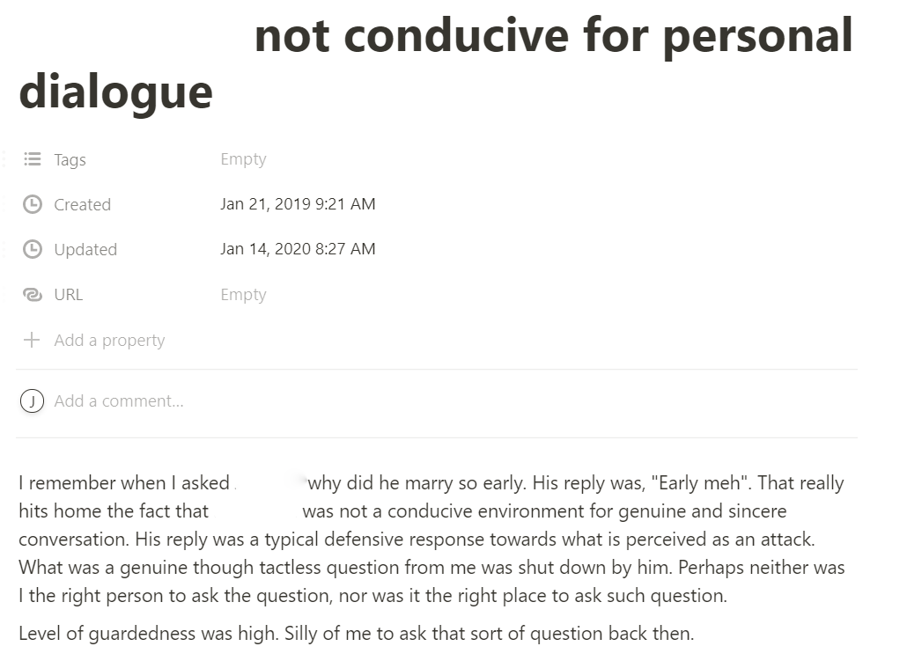

<!--  -->

It's interesting to note the title I wrote: NS office not conducive for personal dialogue. By personal dialogue, I probably meant heart-to-heart talk and meaningful conversations like the ones I had at another shop. That would require a certain level of trust and rapport before I can even venture to ask that question. The question itself "why you marry so early" was a terrible one to be honest; **it was basic and assumed there's something wrong with it. There's nothing wrong, the more accurate thing to say is it's uncommon.** 

I remember he jumped the gun and said "Eh not shotgun ah" when he told us about it. All the more reason I shouldn't have asked that question. **It's something I should only ask when we have opened up to each other.** If I wanted to ask, a better question would be "it must be good to go back to home to your wife after a long day of work" or "you are probably the first few among your friends to get married".

Now we come to the meat of this post: why did I think the "office was not a conducive environment for genuine and sincere conversation"? How did I come to such conclusion? Let's break it down. What are genuine and sincere conversations? Genuine and sincere conversations are the results of amiable interactions between two or more people that encourage self-disclosure. It's the result of close friendships! Let's look at the friendship formula: Friendship = Proximity[^1] x (Frequency + Duration) x Intensity. 

Yes, environment plays a role for all the four factors above. However, it wasn't those kind of hostile, cutthroat environment where we couldn't be friends at all. Then why did I overstate the environment's impact on my making of friendships? I guess what I meant to say was the alpha-male dominance game made it trickier to maneuver: the few consciously status-seeking individuals will colour the bulk of group interactions and turn it competitive in terms of one-upmanship, story telling and jokes. **Irregardless, it's often the case that there will be a few outcasts who are uncomfortable with it and seek friendship. One strategy is to be friends with them and make my own cozy group.** Here's an interesting fact to consider: smol ahbeng still managed to be friends with rich Korean boi despite facing the same circumstances. What does that say about my initial theory?

[^1]: Proximity is the distance between you and another individual. It's easier for people who share the same physical space to bump into each other, however it must take place in a non-hostile environment. Frequency and duration determines the number of contacts and length of time you spend with another individual over time. The more contacts you have with another individual, the more influence they have over your thoughts and actions. Intensity is how satisfying the interactions have been at fulfilling the individual's needs.
